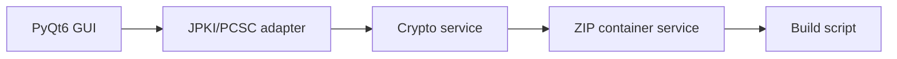

# JPKI Image Signer 設計書

| 項目 | 内容 |
|---|---|
| 文書名 | JPKI Image Signer 設計書 |
| バージョン | 1.0 |
| 作成日 | 2026-05-12 |
| 対象システム | PyQt6 デスクトップアプリ |
| 配置 | `docs/設計書.md` / `docs/設計書.xlsx` |

## 1. はじめに

本書は、`jpki-image-signer` の目的、構成、機能、データ、セキュリティ、運用観点を引継ぎ可能な粒度で整理する設計書である。

## 2. システム概要

マイナンバーカードの署名用電子証明書で画像の作成者性と非改ざん性を証明する Windows ツール

### 2.1 利用者

- 画像作成者
- 検証者
- 配布・監査担当

### 2.2 スコープ内

- JPEG/PNG の署名コンテナ作成
- .jpkiimg の検証
- PC/SC カードリーダー経由の JPKI 署名
- PIN 残回数保護
- PyInstaller 配布

### 2.3 スコープ外

- 画像本体への EXIF/XMP 埋め込み
- クラウド保管
- 本人確認業務の代行

## 3. アーキテクチャ

### 3.1 技術スタック

| 区分 | 採用技術 | 用途 |
|---|---|---|
| 実装 | リポジトリ内ソース | README と主要ファイルに準拠 |

### 3.2 主要ファイル

| パス | 役割 |
|---|---|
| `.gitignore` | 主要ソース/設定ファイル |
| `build.py` | 主要ソース/設定ファイル |
| `design_document.xlsx` | 主要ソース/設定ファイル |
| `generate_design_document.py` | 主要ソース/設定ファイル |
| `LICENSE` | 主要ソース/設定ファイル |
| `README.md` | 利用方法・概要 |
| `assets/icon.ico` | 主要ソース/設定ファイル |
| `assets/icon.png` | 主要ソース/設定ファイル |
| `docs/design_document.xlsx` | 主要ソース/設定ファイル |
| `docs/generate_design_document.py` | 主要ソース/設定ファイル |
| `docs/inspect_cert_san.py` | 主要ソース/設定ファイル |
| `docs/make_sample_image.py` | 主要ソース/設定ファイル |
| `docs/sample.jpg` | 主要ソース/設定ファイル |
| `phase1/test_01_connect.py` | テスト |
| `phase1/test_02_read_cert.py` | テスト |
| `phase1/test_03_sign.py` | テスト |
| `phase1/test_04_verify_dummy.py` | テスト |
| `phase2/__init__.py` | 主要ソース/設定ファイル |
| `phase3/app.py` | 主要ソース/設定ファイル |
| `phase3/__init__.py` | 主要ソース/設定ファイル |

## 4. データ・設定モデル

| データ | 形式 | 説明 |
|---|---|---|
| .jpkiimg | ZIP_STORED | target_image.*, signature.p7s, cert.der |
| 証明書 | X.509 DER | 署名検証用公開鍵と証明書情報 |
| 署名 | PKCS#7 detached | 元画像ハッシュに対する署名 |

## 5. 機能仕様

| ID | 機能 | 仕様 |
|---|---|---|
| F-01 | 署名 | 元画像、PKCS#7 分離署名、証明書を無圧縮 ZIP コンテナに格納する。 |
| F-02 | 検証 | target_image の SHA-256 と署名・証明書を検証し、改ざん有無を判定する。 |
| F-03 | GUI | ドラッグ&ドロップで署名・検証操作を実行する。 |
| F-04 | 安全装置 | PIN 残回数確認と閾値未満の自動中止を行う。 |

## 6. セキュリティ・品質

- 元画像を再エンコードせずバイナリ同一性を守る。
- PIN は保持せず、処理後にメモリ上から破棄する設計とする。
- 検証処理はオフラインで完結する。

## 7. デプロイ・運用

- py -3.12 -m phase3.app で開発起動
- build.py で onedir/onefile 配布物を生成
- テストで暗号フローとコンテナ仕様を確認

## 8. 既知の制約と今後の拡張

- 自動変換・自動判定を含む機能は、利用者または担当者レビューを前提とする。
- 本番利用前に対象データ、権限、ログ、バックアップ、例外処理を運用環境に合わせて確認する。
- README と実装差分が出た場合は、実装側を正として本書を更新する。

## 付録 A. 改訂履歴

| 版 | 日付 | 内容 |
|---|---|---|
| 1.0 | 2026-05-12 | 初版作成 |
